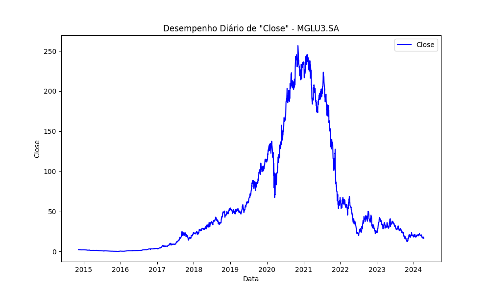
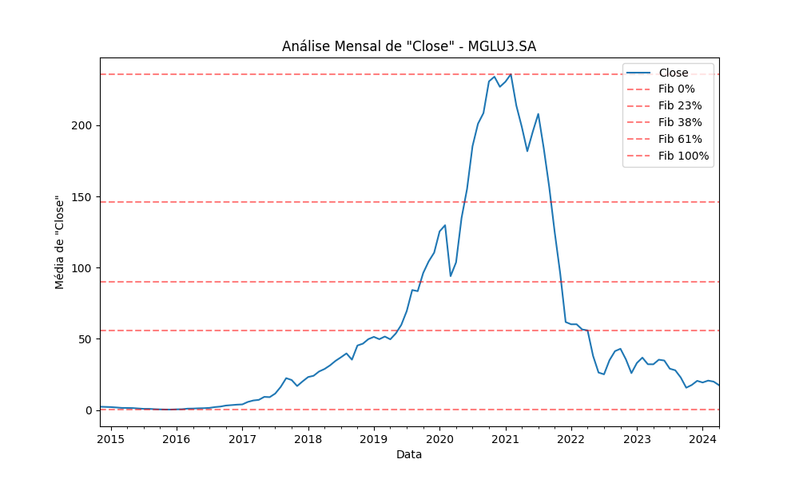
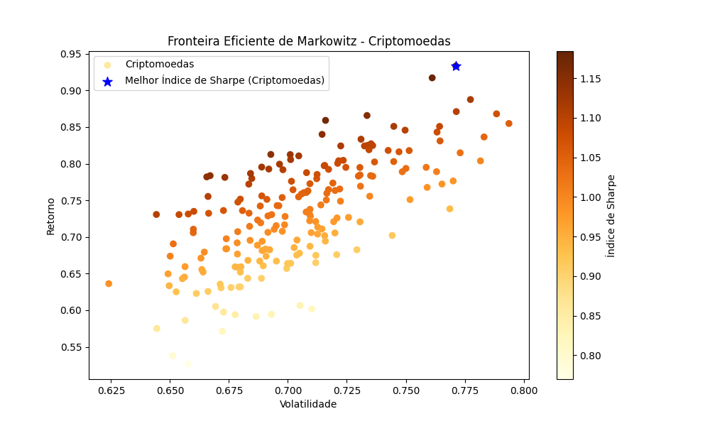
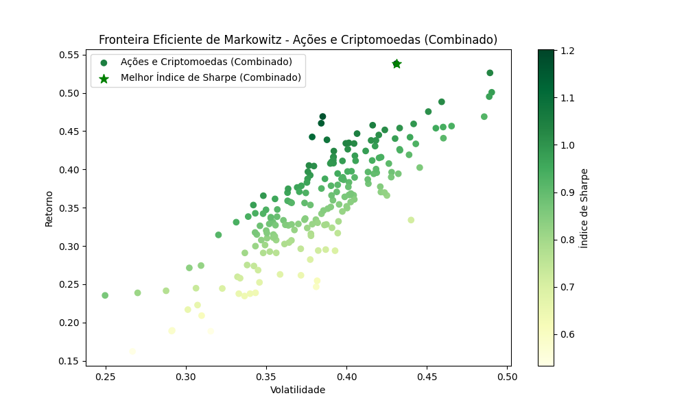
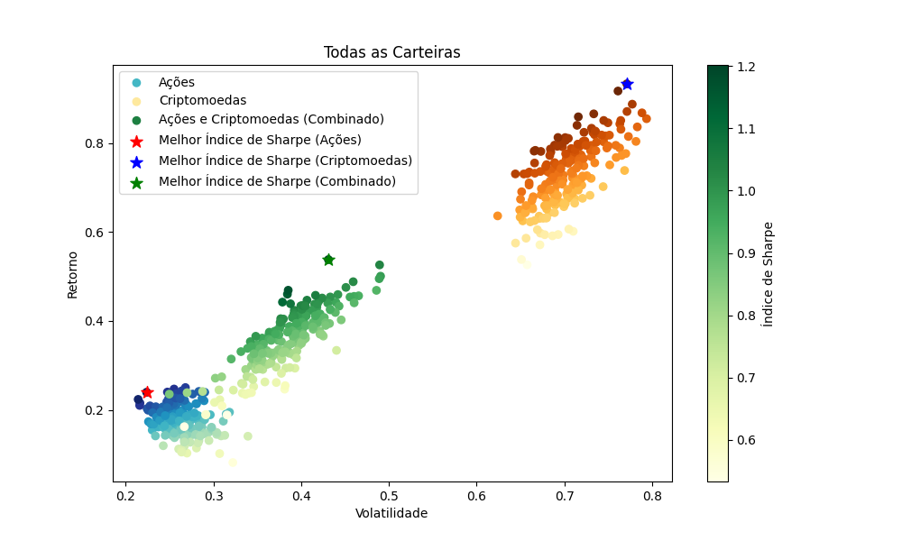
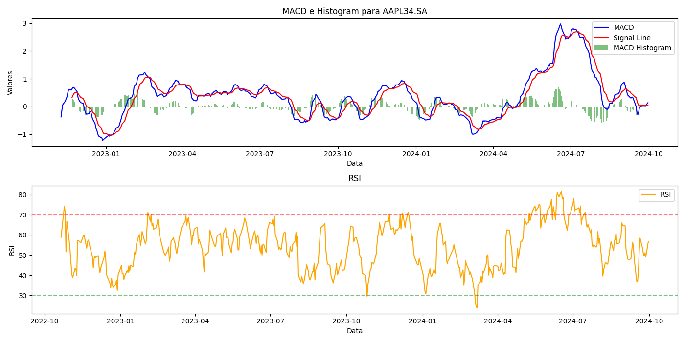

# Data Analytics - Crypto & Stocks

## Descrição
Este projeto é focado na análise de dados de ações e criptomoedas utilizando diversas ferramentas de análise técnica e financeira. O objetivo é facilitar a visualização de tendências e a construção de carteiras de investimentos otimizadas. Uma das principais funcionalidades do projeto é a coleta de dados em tempo real utilizando a biblioteca `yfinance`, eliminando a necessidade de um dataset pré-carregado.

### Funcionalidades

#### 1. **Análise Técnica com MACD e RSI** (Novas Atualizações)
Foi incluído um novo código que realiza análises detalhadas utilizando os indicadores **MACD** (Moving Average Convergence Divergence) e **RSI** (Relative Strength Index). Estes indicadores são cruciais para avaliar a força de um ativo e identificar tendências de mercado.

- **MACD**: O MACD consiste na diferença entre duas médias móveis exponenciais, uma de curto prazo e outra de longo prazo. Além disso, o gráfico inclui:
  - **Linha de Sinal**: uma média da linha MACD, utilizada para identificar pontos de entrada ou saída.
  - **Histograma**: a diferença entre a linha MACD e a linha de sinal, visualizando claramente as divergências de alta e baixa.

- **RSI**: O RSI mede a força ou fraqueza de um ativo baseado nos movimentos de preços recentes. Ajuda a identificar se um ativo está sobrecomprado ou sobrevendido, facilitando decisões de compra e venda.

#### 2. **Níveis de Fibonacci**
O projeto também inclui a aplicação da análise de **Fibonacci** para identificar possíveis níveis de suporte e resistência no mercado. Utilizando os **retracements de Fibonacci**, o código facilita a previsão de reversões de preço em diferentes níveis-chave, que são amplamente usados para calcular pontos de entrada e saída no mercado.

Os níveis de Fibonacci são uma ferramenta técnica que divide as distâncias entre os preços mais altos e baixos em proporções matemáticas, como 23,6%, 38,2%, 50%, 61,8%, e 100%. Esses níveis ajudam a prever reversões de tendência e são úteis para traders que buscam pontos de reversão de suporte e resistência.

#### 3. **Carteira de Markowitz**
Além das análises técnicas, o projeto inclui uma implementação da **Carteira de Markowitz** (Teoria Moderna de Portfólios). Esta teoria ajuda a otimizar carteiras de investimento balanceando o risco e o retorno esperado. Usando essa abordagem, o código calcula:
- **Retorno esperado**: baseado na média ponderada dos retornos dos ativos.
- **Risco**: através da volatilidade dos ativos.
- **Fronteira eficiente**: a combinação de ativos que oferece o maior retorno esperado para um determinado nível de risco.

#### 4. **Coleta de Dados Automática com `yfinance`**
Uma das grandes facilidades do projeto é a integração com a biblioteca `yfinance`, que coleta dados financeiros diretamente da internet, eliminando a necessidade de carregar datasets manualmente. Isso permite ao usuário realizar análises sobre qualquer ativo financeiro disponível no Yahoo Finance sem precisar de um banco de dados prévio.

- **Vantagens**:
  - **Automatização**: Não há necessidade de preparar datasets; o código coleta automaticamente os dados mais recentes dos ativos.
  - **Atualização em tempo real**: O código utiliza os dados mais recentes disponíveis, permitindo análises precisas e atualizadas.
  - **Flexibilidade**: Você pode escolher qualquer ativo listado no Yahoo Finance, tanto ações quanto criptomoedas, facilitando análises rápidas e eficientes.

### Exemplos de Gráficos Gerados

Aqui estão alguns exemplos dos gráficos gerados pelo código:

- **Exemplo de Análise MACD,  RSI, Fibonacci,  Markowitz**:
  
  
  
  
  
  
  

### Como Executar o Projeto

1. **Clone o repositório:**
   ```bash
   git clone <URL do seu repositório>

